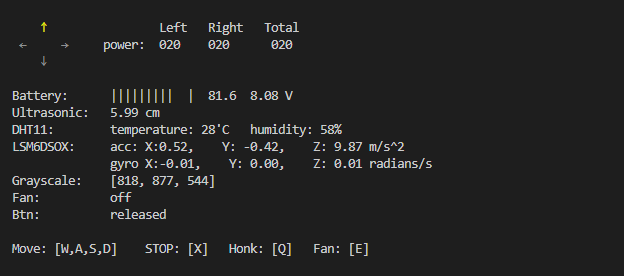

# Examples

<a id="basic-test"></a>

## Basic test

> ```default
> cd bella-hat
> python3 examples/basic_test.py
> ```

> 

## Reset MCU

> Reset the MCU on the Bella HAT.

> ```default
> bella-hat reset_mcu
> ```
